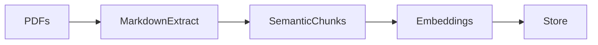
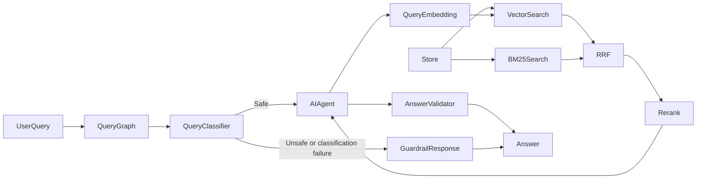

# Document Knowledge Base with Source Grounding

Semorai technical interview task: a PDF knowledge-base QA system that answers questions from indexed documents and cites the source pages used as evidence.

The project builds a retrieval-augmented generation pipeline around local PDF ingestion, persistent vector search, reranking, and a FastAPI API backed by Pydantic-AI. The agent is instructed to answer only from retrieved evidence and to cite sources inline using the format `[pdf_name, page X]`.

## Features

- PDF ingestion from a configurable document folder.
- OCR-capable text extraction into per-page Markdown.
- Markdown/header-aware chunking to preserve document structure.
- OpenAI embeddings for semantic retrieval.
- BM25 keyword retrieval using an independently loaded copy of the cross-encoder tokenizer.
- ChromaDB persistence for local vector storage.
- Reciprocal Rank Fusion (RRF) of semantic and keyword candidates.
- Cross-encoder reranking to improve retrieval precision.
- Tool-less structured query classification for safety.
- LangGraph-orchestrated FastAPI endpoint that returns either a validated grounded answer or a fixed guardrail response.
- Source-grounded answers with page-level citations.
- Schema-constrained faithfulness and context-sufficiency validation.
- Langfuse Cloud traces for query, retrieval, model usage, validation, and ingestion.

## How It Works

**Ingest**


**Serve**


Ingestion turns PDFs into structured, embedded chunks stored in ChromaDB. At query time, the agent retrieves and reranks relevant chunks before answering with page-level citations.

## Design Note

The architecture separates ingestion, retrieval, reranking, and answering so each part has a clear responsibility.

- Markdown/header-aware chunking is used instead of fixed-size chunking because headings preserve useful document context and usually produce more meaningful retrieval units.
- ChromaDB is used as a local persistent vector store, which keeps the project easy to run without requiring external database infrastructure.
- Vector and BM25 search retrieve complementary semantic and keyword candidate
  sets. RRF combines their ranks before the cross-encoder promotes the chunks
  that best match the exact question.
- Pydantic-AI keeps the agent layer small, while FastAPI exposes a minimal buffered query endpoint. Answers are held until their evidence validation is complete.
- Docker separates one-shot ingestion from long-running serving because indexing documents and answering questions have different lifecycles.

## Project Structure

```text
src/
  agent/        Pydantic-AI QA agent and retrieval tools
  config/       Environment-driven application settings
  ingestion/    PDF parsing, chunking, embedding, and ingestion pipeline
  orchestration/ LangGraph query workflow
  retrieval/    ChromaDB vector store and cross-encoder reranker
  utils/        Logging and shared domain models
data/           Input PDFs for ingestion
Dockerfile      Runtime image for the buffered API
Dockerfile.ingest
docker-compose.yml
```

## Prerequisites

- Python 3.11 or newer.
- [uv](https://docs.astral.sh/uv/) for dependency management.
- An OpenAI API key.
- PDFs placed in `data/`.
- Docker and Docker Compose if using the containerized workflow.

## Configuration

Create a local `.env` file from the example file:

```powershell
Copy-Item env.example .env
```

Required:

```env
OPENAI_API_KEY=sk-...
```

Langfuse Cloud observability is optional and activates when credentials are
present. The endpoint below uses the EU region:

```env
LANGFUSE_PUBLIC_KEY=pk-lf-...
LANGFUSE_SECRET_KEY=sk-lf-...
LANGFUSE_BASE_URL=https://cloud.langfuse.com
LANGFUSE_TRACING_ENABLED=true
LANGFUSE_TRACING_ENVIRONMENT=development
```

Common optional settings:

```env
PDF_FOLDER=./data
EMBED_MODEL=text-embedding-3-small
EMBED_BATCH_SIZE=500
CHROMA_COLLECTION=knowledge_base
CHROMA_PERSIST_DIR=./knowledge_base
RERANKER_MODEL=cross-encoder/ms-marco-MiniLM-L-6-v2
RERANKER_CACHE_DIR=./hf_models
RERANKER_THRESHOLD=0.0
CLASSIFIER_MODEL=gpt-5.4-nano
VALIDATOR_MODEL=gpt-5.4-nano
LLM_MODEL=openai:gpt-4o-mini
LLM_TEMPERATURE=0.0
DENSE_TOP_K=25
BM25_TOP_K=25
FUSION_TOP_K=25
FINAL_TOP_K=10
RRF_K=60
```

## Observability

Each `/query` request creates one `kb.query` trace. It contains the safety
classification, the automatically instrumented Pydantic-AI agent and its model
and tool calls, one aggregate `retrieve_and_rerank` observation, the answer
validator, and the final request outcome. Successful validation adds boolean
`faithfulness` and `context_sufficiency` scores to the trace. The response also
includes `X-Langfuse-Trace-Id` when tracing is active.

The ingestion command creates one `kb.ingestion` trace with document, chunk,
and failure counts. Embedding calls record batch sizes, dimensions, token usage,
and cost metadata, but never embedding vectors. Retrieval observations record
selected chunk IDs, source pages, and reranker scores rather than duplicating
document text.

Tracing is fail-open: missing Langfuse credentials or exporter failures do not
change API results. Set `LANGFUSE_TRACING_ENABLED=false` to disable it explicitly.
Model and tool instrumentation may include user queries, answers, and retrieved
chunk text, so only enable Cloud tracing when that content is permitted to leave
the deployment environment.

## Local Usage

Install both application pipelines:

```powershell
uv sync --all-extras
```

Ingest PDFs into the local ChromaDB store:

```powershell
uv run --extra ingest python src\ingest.py
```

Start the API:

```powershell
uv run --extra serve python src\serve.py
```

The server starts on `http://localhost:8000` by default. Override `HOST` or `PORT` in the environment if needed.

Send a query and receive the complete validated answer:

```powershell
curl.exe -X POST http://localhost:8000/query `
  -H "Content-Type: application/json" `
  -d '{"query":"What are the main findings?"}'
```

The endpoint accepts a JSON object with one `query` field and returns the complete answer and validation as `text/plain`. It buffers generation until validation finishes, so unvalidated answer text is never sent. Invalid requests return a FastAPI validation error, and unexpected processing failures return a sanitized service error.

Before the QA agent runs, a separate tool-less classifier returns a structured
`safety` assessment. Safe requests reach the retrieval-backed QA agent regardless
of whether their topic appears relevant to the indexed documents. The agent must
answer only from retrieved evidence and say when that evidence is insufficient.
Unsafe requests receive a fixed application-owned response through the same
endpoint. If safety classification fails, the graph fails closed and does not
invoke the QA agent.

For admitted queries, every chunk returned to the QA agent is captured in
request-local state and deduplicated by its stable chunk ID. After generation, a
separate schema-constrained validator receives the original query, the unique
chunk text and source metadata, and the complete answer. Retrieval and reranker
scores are deliberately excluded. It returns two boolean checks:

- `faithfulness`: whether every material answer claim is supported by the chunks.
- `context_sufficiency`: whether the chunks can fully answer the query.

A concise reason is included whenever either result is false. If validation is
temporarily unavailable, the answer is returned with both results marked
`unavailable`; the service never fabricates boolean results.

## Docker Usage

Build and run ingestion once:

```powershell
docker compose run --rm ingest
```

Start the API:

```powershell
docker compose up serve
```

The Docker setup uses named volumes:

- `knowledge_base` persists the ChromaDB index between container runs.
- `hf_models` caches Hugging Face reranker model files.

Run ingestion again whenever PDFs change:

```powershell
docker compose run --rm ingest
```

## Source Grounding

The QA agent is instructed to use retrieval tools before answering and to answer only from retrieved document evidence. Factual claims should be supported with inline citations in this format:

```text
[pdf_name, page X]
```

If the indexed documents do not contain enough evidence, the agent should say that the answer is not available from the provided documents instead of relying on outside knowledge.

## Known Limitations

- OCR is supported for text extraction, but images are skipped; no image embeddings are performed currently.
- No auth or rate limiting is currently included.

## License

This project is licensed under the Apache License 2.0. See [LICENSE](LICENSE) for details.
