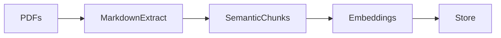
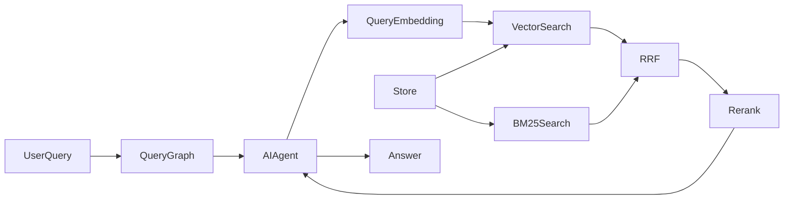

# Document Knowledge Base with Source Grounding

Semorai technical interview task: a PDF knowledge-base QA system that answers questions from indexed documents and cites the source pages used as evidence.

The project builds a retrieval-augmented generation pipeline around local PDF ingestion, persistent vector search, reranking, and a FastAPI streaming API backed by Pydantic-AI. The agent is instructed to answer only from retrieved evidence and to cite sources inline using the format `[pdf_name, page X]`.

## Features

- PDF ingestion from a configurable document folder.
- OCR-capable text extraction into per-page Markdown.
- Markdown/header-aware chunking to preserve document structure.
- OpenAI embeddings for semantic retrieval.
- BM25 keyword retrieval using an independently loaded copy of the cross-encoder tokenizer.
- ChromaDB persistence for local vector storage.
- Reciprocal Rank Fusion (RRF) of semantic and keyword candidates.
- Cross-encoder reranking to improve retrieval precision.
- LangGraph-orchestrated FastAPI endpoint that streams the Pydantic-AI agent's final answer.
- Source-grounded answers with page-level citations.

## How It Works

**Ingest**


**Serve**


Ingestion turns PDFs into structured, embedded chunks stored in ChromaDB. At query time, the agent retrieves and reranks relevant chunks before answering with page-level citations.

## Design Note

The architecture separates ingestion, retrieval, reranking, and answering so each part has a clear responsibility.

- Markdown/header-aware chunking is used instead of fixed-size chunking because headings preserve useful document context and usually produce more meaningful retrieval units.
- ChromaDB is used as a local persistent vector store, which keeps the project easy to run without requiring external database infrastructure.
- Vector and BM25 search retrieve complementary semantic and keyword candidate
  sets. RRF combines their ranks before the cross-encoder promotes the chunks
  that best match the exact question.
- Pydantic-AI keeps the agent layer small, while FastAPI exposes a minimal streaming query endpoint.
- Docker separates one-shot ingestion from long-running serving because indexing documents and answering questions have different lifecycles.

## Project Structure

```text
src/
  agent/        Pydantic-AI QA agent and retrieval tools
  config/       Environment-driven application settings
  ingestion/    PDF parsing, chunking, embedding, and ingestion pipeline
  orchestration/ LangGraph query workflow
  retrieval/    ChromaDB vector store and cross-encoder reranker
  utils/        Logging and shared domain models
data/           Input PDFs for ingestion
Dockerfile      Runtime image for the streaming API
Dockerfile.ingest
docker-compose.yml
```

## Prerequisites

- Python 3.11 or newer.
- An OpenAI API key.
- PDFs placed in `data/`.
- Docker and Docker Compose if using the containerized workflow.

## Configuration

Create a local `.env` file from the example file:

```powershell
Copy-Item env.example .env
```

Required:

```env
OPENAI_API_KEY=sk-...
```

Common optional settings:

```env
PDF_FOLDER=./data
EMBED_MODEL=text-embedding-3-small
EMBED_BATCH_SIZE=500
CHROMA_COLLECTION=knowledge_base
CHROMA_PERSIST_DIR=./knowledge_base
RERANKER_MODEL=cross-encoder/ms-marco-MiniLM-L-6-v2
RERANKER_CACHE_DIR=./hf_models
RERANKER_THRESHOLD=0.0
LLM_MODEL=openai:gpt-4o-mini
LLM_TEMPERATURE=0.0
DENSE_TOP_K=25
BM25_TOP_K=25
FUSION_TOP_K=25
FINAL_TOP_K=10
RRF_K=60
```

## Local Usage

Install dependencies:

```powershell
python -m venv .venv
.\.venv\Scripts\activate
pip install -r requirements.txt
```

Ingest PDFs into the local ChromaDB store:

```powershell
python src\ingest.py
```

Start the API:

```powershell
python src\serve.py
```

The server starts on `http://localhost:8000` by default. Override `HOST` or `PORT` in the environment if needed.

Send a query and stream the final answer:

```powershell
curl.exe --no-buffer -X POST http://localhost:8000/query `
  -H "Content-Type: application/json" `
  -d '{"query":"What are the main findings?"}'
```

The endpoint accepts a JSON object with one `query` field and returns the answer as `text/plain`. Invalid requests return a FastAPI validation error. Once streaming starts the HTTP status is already committed, so unexpected agent failures are logged and returned as sanitized error text.

## Docker Usage

Build and run ingestion once:

```powershell
docker compose run --rm ingest
```

Start the API:

```powershell
docker compose up serve
```

The Docker setup uses named volumes:

- `knowledge_base` persists the ChromaDB index between container runs.
- `hf_models` caches Hugging Face reranker model files.

Run ingestion again whenever PDFs change:

```powershell
docker compose run --rm ingest
```

## Source Grounding

The QA agent is instructed to use retrieval tools before answering and to answer only from retrieved document evidence. Factual claims should be supported with inline citations in this format:

```text
[pdf_name, page X]
```

If the indexed documents do not contain enough evidence, the agent should say that the answer is not available from the provided documents instead of relying on outside knowledge.

## Known Limitations

- OCR is supported for text extraction, but images are skipped; no image embeddings are performed currently.
- No auth, rate limiting, production monitoring, or formal test suite is currently documented.

## License

This project is licensed under the Apache License 2.0. See [LICENSE](LICENSE) for details.
