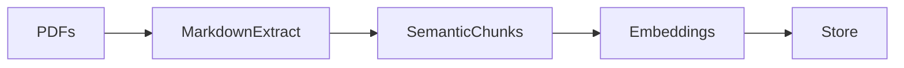
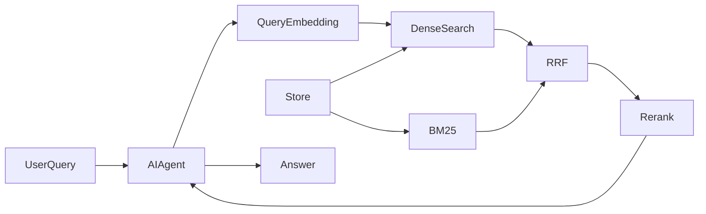

# Document Knowledge Base with Source Grounding

Semorai technical interview task: a PDF knowledge-base QA system that answers questions from indexed documents and cites the source pages used as evidence.

The project builds a retrieval-augmented generation pipeline around local PDF ingestion, persistent vector search, reranking, and a Pydantic-AI web agent. The agent is instructed to answer only from retrieved evidence and to cite sources inline using the format `[pdf_name, page X]`.

## Features

- PDF ingestion from a configurable document folder.
- OCR-capable text extraction into per-page Markdown.
- Markdown/header-aware chunking to preserve document structure.
- Multilingual hybrid retrieval using OpenAI embeddings and in-memory BM25S.
- ChromaDB persistence for local vector storage.
- Reciprocal rank fusion (RRF) and multilingual BGE cross-encoder reranking.
- Pydantic-AI web agent for document question answering.
- Source-grounded answers with page-level citations.

## How It Works

**Ingest**


**Serve**


Ingestion turns PDFs into structured, embedded chunks stored in ChromaDB. At serving startup, all stored chunk text and metadata are also loaded into a disposable in-memory BM25S index. Each query runs dense and sparse retrieval with the same document/page filters, fuses their ranks with RRF, and reranks the best candidates before answering with page-level citations.

## Design Note

The architecture separates ingestion, retrieval, reranking, and answering so each part has a clear responsibility.

- Markdown/header-aware chunking is used instead of fixed-size chunking because headings preserve useful document context and usually produce more meaningful retrieval units.
- ChromaDB is used as a local persistent vector store, which keeps the project easy to run without requiring external database infrastructure.
- Dense retrieval handles multilingual semantic matches, while Unicode-aware BM25 retrieval preserves exact names and technical terms without language-specific stemming or stop words.
- Reciprocal rank fusion combines both rankings without assuming their raw scores are directly comparable. `BAAI/bge-reranker-v2-m3` then reranks the fused candidates across languages.
- Pydantic-AI keeps the agent layer small and exposes the QA agent as a web app with minimal glue code.
- Docker separates one-shot ingestion from long-running serving because indexing documents and answering questions have different lifecycles.

## Project Structure

```text
src/
  agent/        Pydantic-AI QA agent and retrieval tools
  config/       Environment-driven application settings
  ingestion/    PDF parsing, chunking, embedding, and ingestion pipeline
  retrieval/    ChromaDB vector store and cross-encoder reranker
  utils/        Logging and shared domain models
data/           Input PDFs for ingestion
Dockerfile      Runtime image for the web agent
Dockerfile.ingest
docker-compose.yml
```

## Prerequisites

- Python 3.11 or newer.
- An OpenAI API key.
- PDFs placed in `data/`.
- Docker and Docker Compose if using the containerized workflow.

## Configuration

Create a local `.env` file from the example file:

```powershell
Copy-Item env.example .env
```

Required:

```env
OPENAI_API_KEY=sk-...
```

Common optional settings:

```env
PDF_FOLDER=./data
EMBED_MODEL=text-embedding-3-small
EMBED_BATCH_SIZE=500
CHROMA_COLLECTION=knowledge_base
CHROMA_PERSIST_DIR=./knowledge_base
RERANKER_MODEL=BAAI/bge-reranker-v2-m3
RERANKER_CACHE_DIR=./hf_models
RERANKER_BATCH_SIZE=8
RERANKER_MAX_LENGTH=512
RERANKER_THRESHOLD=0.0
DENSE_TOP_K=30
SPARSE_TOP_K=30
RRF_K=60
RERANK_CANDIDATES=20
RETRIEVAL_TOP_K=6
LLM_MODEL=openai:gpt-4o-mini
LLM_TEMPERATURE=0.0
```

## Local Usage

Install dependencies:

```powershell
python -m venv .venv
.\.venv\Scripts\activate
python -m pip install --upgrade pip
pip install -r requirements.txt
```

Use a fresh project virtual environment. Installing into a shared Python environment that already contains packages such as Docling, Gradio, Streamlit, or Torchvision can make pip retain incompatible versions from those unrelated applications.

Ingest PDFs into the local ChromaDB store:

```powershell
python src\ingest.py
```

Start the web agent:

```powershell
python src\serve.py
```

The server starts on `http://localhost:8000` by default. Override `HOST` or `PORT` in the environment if needed.

On the first serving start, Hugging Face downloads the multilingual `BAAI/bge-reranker-v2-m3` model into `RERANKER_CACHE_DIR`. Later starts reuse that cache. Restart the application after ingestion so the disposable BM25 index is rebuilt from the updated Chroma collection.

## Docker Usage

Build and run ingestion once:

```powershell
docker compose run --rm ingest
```

Start the web agent:

```powershell
docker compose up serve
```

The Docker setup uses named volumes:

- `knowledge_base` persists the ChromaDB index between container runs.
- `hf_models` caches Hugging Face reranker model files, including the larger multilingual model downloaded on first start.

Run ingestion again whenever PDFs change:

```powershell
docker compose run --rm ingest
```

## Source Grounding

The QA agent is instructed to use retrieval tools before answering and to answer only from retrieved document evidence. Factual claims should be supported with inline citations in this format:

```text
[pdf_name, page X]
```

If the indexed documents do not contain enough evidence, the agent should say that the answer is not available from the provided documents instead of relying on outside knowledge.

## Known Limitations

- OCR is supported for text extraction, but images are skipped; no image embeddings are performed currently.
- No auth, rate limiting, production monitoring, or formal test suite is currently documented.

## License

This project is licensed under the Apache License 2.0. See [LICENSE](LICENSE) for details.
