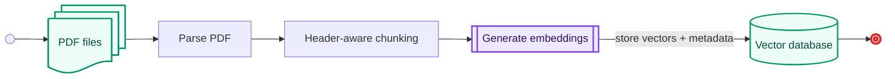
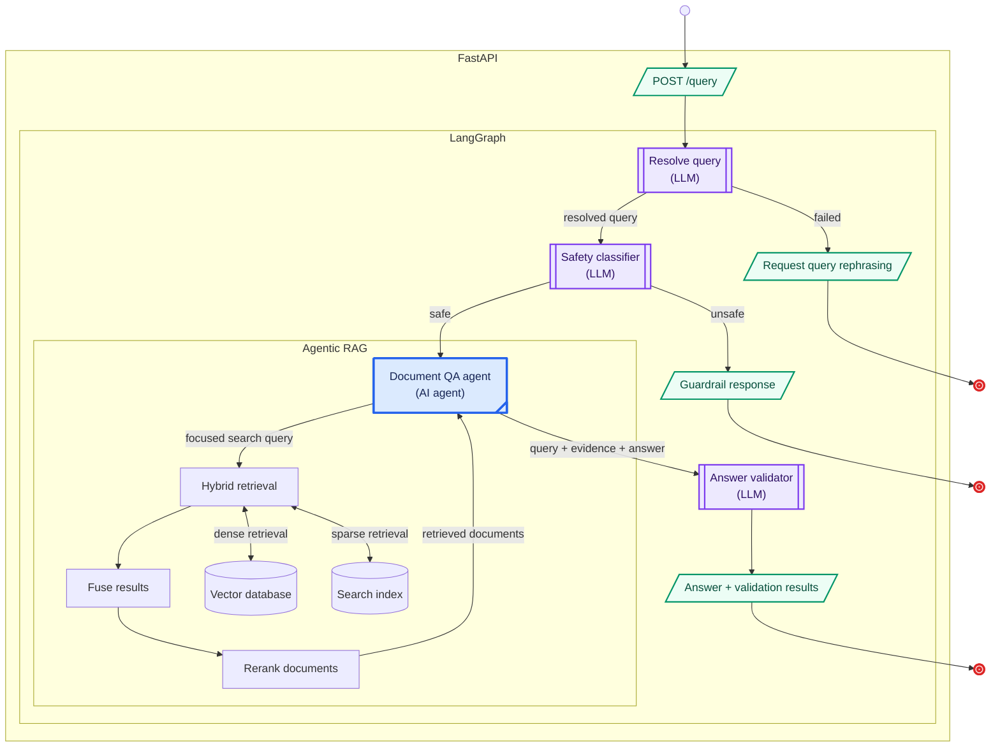
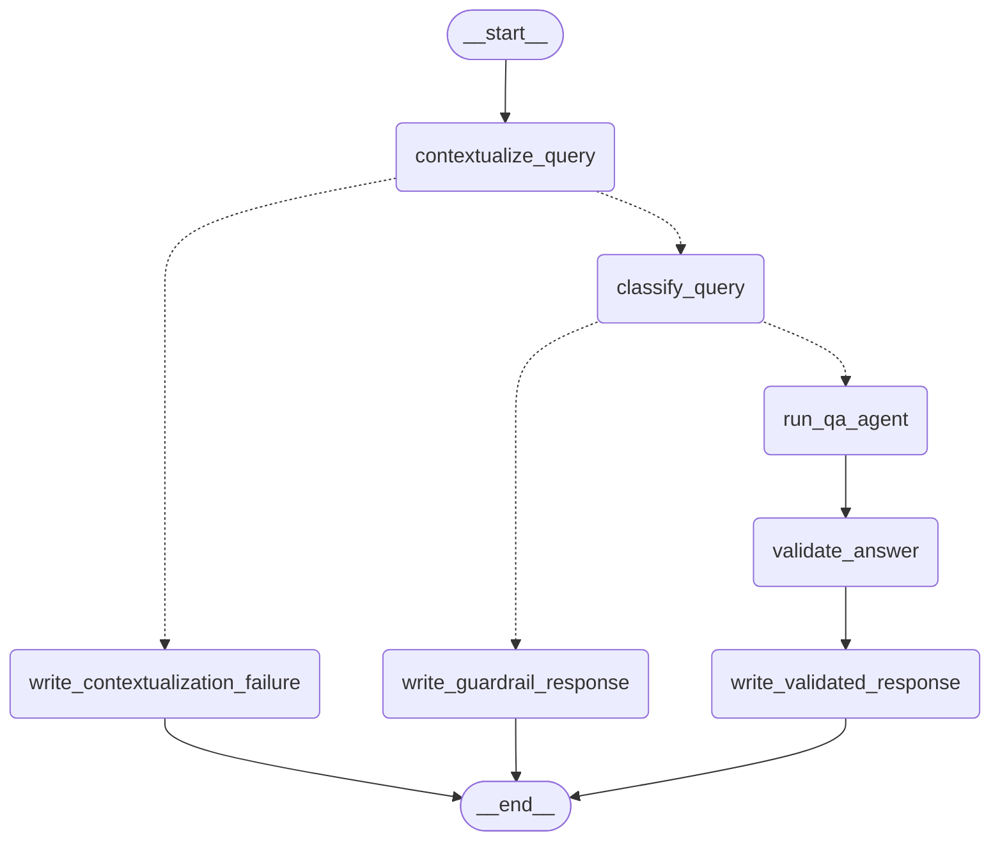

# Document Knowledge Base with Source Grounding

A document question-answering project for indexing local PDFs and answering questions from their contents with **page-level source references**.

## How It Works

### Ingestion lifecycle



1. **Extract:** `PyMuPDF4LLM` converts each PDF into Markdown while preserving page boundaries. The parser relies on PyMuPDF4LLM's default automatic OCR behavior.
2. **Chunk:** Each page is split at Markdown headings. Chunks retain the source filename, page number, and header metadata.
3. **Embed:** The embedding model is configurable and defaults to `text-embedding-3-small`.
4. **Store:** Chunks, metadata, and vectors are upserted into a local persistent `ChromaDB` collection.

### Query lifecycle



- `FastAPI` validates requests and exposes the `POST /query` endpoint.
- `LangGraph` orchestrates the workflow and checkpoints conversation state in `SQLite`.
- **Query resolution** uses the original query unchanged on the first turn. On follow-up turns, a tool-free contextualizer uses recent history to produce a standalone query.
- **Safety classification** evaluates the original and resolved queries in their recent conversational context. Unsafe requests and classifier failures stop before retrieval and answer generation.
- **Agentic RAG** uses a `Pydantic AI` tool-calling agent. The resolved query seeds the agent, which derives focused retrieval queries, evaluates the returned evidence, and can search again before answering.
- **Multilingual hybrid retrieval** builds a stronger evidence set through four stages:

    1. Dense search in ChromaDB finds semantically related passages even when the wording differs.
    2. `BM25` sparse search finds exact terms, names, and identifiers.
    3. `Reciprocal Rank Fusion` combines both ranked lists without normalizing their scores.
    4. The multilingual `cross-encoder/mmarco-mMiniLMv2-L12-H384-v1` model jointly scores each query-document pair and reranks the candidates.

- **Answer validation** applies two separate Boolean checks: whether the answer is faithful to the evidence and whether the retrieved context is sufficient for the query. A reason is returned for each failed check.
- **Langfuse** optionally traces workflow decisions, model and tool calls, retrieval activity, validation results, latency, token usage, and available cost data.

> Confidence scores can suffer from variance and drift, whereas boolean evaluations provide clearer and more repeatable decisions. That is the reason for having a boolean validation.

## Architecture Decisions

| Area | Decision | Key point |
| --- | --- | --- |
| Runtime | Separate data ingestion and QA serving lifecycles | Indexing is independent of API startup and availability. |
| Chunking | Preserve page boundaries and split by headings | Chunks retain semantic structure and page-level citation metadata. |
| Retrieval | Combine dense search and BM25 using RRF and reranking | Semantic and exact-term matches contribute to one ranked result set. |
| Answering | Use a tool-calling agent grounded in retrieved evidence | The agent can run multiple searches and must cite source pages. |
| Orchestration | Use LangGraph for context, safety, QA, and validation | Stateful, scalable control flow. |
| Persistence | Store vectors in ChromaDB and conversations in SQLite | Document knowledge and conversation state remain separate. |
| Quality | Validate faithfulness and context sufficiency independently | Answer fluency alone is not treated as evidence of correctness. |
| Containerization | Use separate Docker images managed with Docker Compose | Ingestion and serving remain isolated while sharing persistent data volumes. |
| Observability | Enable Langfuse when tracing is needed | Model calls, retrieval, validation, latency, and cost become inspectable. |

## Query Graph



## Project Structure

```text
src/
  agent/          Pydantic AI document QA agent and retrieval tool
  config/         Environment-driven application settings
  ingestion/      PDF parsing, chunking, embedding, and ingestion pipeline
  orchestration/  Safety classification, answer validation, and query graph
  retrieval/      ChromaDB, BM25, RRF, and cross-encoder reranking
  utils/          Logging, observability helpers, and shared models
  ingest.py       Ingestion CLI entry point
  serve.py        FastAPI entry point
data/             Input PDFs used by the local and Docker ingestion workflows
pyproject.toml     Direct dependency definitions and uv project metadata
uv.lock            Fully resolved dependency lockfile
Dockerfile         Serving image
Dockerfile.ingest  Ingestion image
docker-compose.yml Ingestion and serving services with persistent volumes
env.example        Environment variable template
```

`pyproject.toml` and `uv.lock` are the dependency sources of truth.

## Prerequisites

- Python 3.11 or newer.
- [uv](https://docs.astral.sh/uv/) for local dependency management.
- An OpenAI API key.
- Internet access for OpenAI API calls and the initial Hugging Face model download.
- One or more PDFs in `data/`, or another directory selected with `PDF_FOLDER`.
- Docker with Docker Compose for the container workflow.

## Configuration

The ingestion and serving dependencies call `load_dotenv()` before loading application settings. Existing process environment variables take precedence over `.env`; defaults are used for variables that are absent.

To use a local dotenv file, copy the template and provide your values:

```powershell
Copy-Item env.example .env
```

Replace the example values you use. If Langfuse tracing is not required, remove or comment out its placeholder public and secret keys; nonempty placeholders make the application treat tracing as configured.

`OPENAI_API_KEY` is the only required application setting:

```env
OPENAI_API_KEY=sk-...
```

The configurable defaults are:

| Variable | Default | Used by |
| --- | --- | --- |
| `PDF_FOLDER` | `./data` | Ingestion |
| `EMBED_MODEL` | `text-embedding-3-small` | Both pipelines |
| `EMBED_BATCH_SIZE` | `500` | Both pipelines |
| `CHROMA_COLLECTION` | `knowledge_base` | Both pipelines |
| `CHROMA_PERSIST_DIR` | `./knowledge_base` | Both pipelines |
| `RERANKER_MODEL` | `cross-encoder/mmarco-mMiniLMv2-L12-H384-v1` | Serving |
| `RERANKER_CACHE_DIR` | `./hf_models` | Serving |
| `CLASSIFIER_MODEL` | `gpt-5.4-nano` | Serving |
| `CONTEXTUALIZER_MODEL` | `gpt-5.4-nano` | Serving |
| `VALIDATOR_MODEL` | `gpt-5.4-nano` | Serving |
| `LLM_MODEL` | `openai:gpt-5.4` | Serving |
| `LLM_TEMPERATURE` | `0.0` | Serving |
| `DENSE_TOP_K` | `25` | Serving |
| `BM25_TOP_K` | `25` | Serving |
| `FUSION_TOP_K` | `25` | Serving |
| `FINAL_TOP_K` | `10` | Serving |
| `RRF_K` | `60` | Serving |
| `CONVERSATION_CHECKPOINT_PATH` | `./conversation_checkpoints.sqlite3` | Serving |
| `HISTORY_MAX_TURNS` | `10` | Serving |
| `LANGGRAPH_STRICT_MSGPACK` | `true` | Serving |
| `HOST` | `0.0.0.0` | `src/serve.py` process |
| `PORT` | `8000` | `src/serve.py` process |

Numeric settings must contain valid integer or floating-point values. `EMBED_BATCH_SIZE` must be positive, `HISTORY_MAX_TURNS` must be at least `1`, and `RRF_K` must be nonnegative. Retrieval limits should be positive to return evidence. ChromaDB uses cosine distance; supported extensions, Markdown header levels, and parallel agent tool calls are fixed in code.

For local `python src/serve.py` runs, set `HOST` and `PORT` in the process environment. They are read before the serving dependencies load `.env`. Docker Compose supplies them through the service environment.

### Optional Langfuse configuration

The application treats tracing as configured when both `LANGFUSE_PUBLIC_KEY` and `LANGFUSE_SECRET_KEY` are present. The example below selects Langfuse Cloud's EU region:

```env
LANGFUSE_PUBLIC_KEY=pk-lf-...
LANGFUSE_SECRET_KEY=sk-lf-...
LANGFUSE_BASE_URL=https://cloud.langfuse.com
LANGFUSE_TRACING_ENABLED=true
LANGFUSE_TRACING_ENVIRONMENT=development
```

The Langfuse SDK also supports `LANGFUSE_TRACING_ENABLED=false` to disable exporting traces. Model and tool instrumentation may include user queries, generated answers, and retrieved text, so enable remote tracing only when that content may leave the deployment environment.

## Observability

When Langfuse credentials are configured, each `/query` request creates a `kb.query` observation containing query resolution, safety classification, the Pydantic AI agent's model and tool spans, retrieval summaries, answer validation, and the final workflow outcome. Successfully completed validation adds Boolean `faithfulness` and `context_sufficiency` trace scores. The response includes `X-Langfuse-Trace-Id` when a trace ID is available.

The ingestion command creates a `kb.ingestion` observation with document, chunk, and failed-file counts. Embedding observations record batch sizes, dimensions, and token usage, but not embedding vectors. Manual retrieval observations record selected chunk IDs, source pages, and reranker scores. Tracing helpers are designed to fail open, although instrumented model and tool calls remain subject to Langfuse SDK behavior.

## Local Usage

Install the dependencies for both pipelines:

```powershell
uv sync --all-extras
```

Ingest PDFs into the local ChromaDB collection:

```powershell
uv run --extra ingest python src/ingest.py
```

The command exits with an error when the configured folder is missing or contains no matching PDF files. A failure processing an individual PDF is logged and skipped; the remaining files continue, and the command does not fail solely because one or more individual files were skipped.

Start the API:

```powershell
uv run --extra serve python src/serve.py
```

The default address is `http://localhost:8000`. The reranker and tokenizer are loaded during startup, and their first run downloads model files into `RERANKER_CACHE_DIR`.

Send a query:

```powershell
curl.exe -X POST http://localhost:8000/query `
  -H "Content-Type: application/json" `
  -d '{"conversation_id":"14f29586-8309-4e0e-87e3-b53877c935fa","query":"What are the main findings?"}'
```

## API

### `POST /query`

The endpoint accepts a UUID `conversation_id` and one `query` string. The submitted string must contain between 1 and 10,000 characters. Leading and trailing whitespace is then removed, and a whitespace-only query is rejected. Generate a new conversation ID for the first turn and reuse it for every follow-up in that conversation.

```json
{
  "conversation_id": "14f29586-8309-4e0e-87e3-b53877c935fa",
  "query": "What are the main findings?"
}
```

LangGraph checkpoints conversation state in SQLite. The first turn uses the submitted query directly; on follow-up turns, a tool-free contextualizer uses recent exchanges to produce a standalone query. The classifier sees the original query, resolved query, and recent history. The QA agent receives the resolved query and history, then formulates focused retrieval queries.

Only a completed QA path appends a turn containing the user's original wording and the generated answer. Guardrail, classification-failure, and contextualization-failure responses are not appended. Retrieval results are visible to the agent during the current run but are not persisted as model-visible history for later turns.

Responses produced by the query workflow are `text/plain`. For a completed QA path, the body contains the generated answer followed by a `Validation` block:

```text
<answer with inline source references>

Validation
- Faithful to retrieved documents: true
- Context sufficient to fully answer the query: false
- Context sufficiency reason: <reason from the validator>
```

HTTP 200 means the application completed one of its defined workflow paths; it does not by itself mean the answer passed both validation checks.

Every workflow response includes `X-Conversation-Id` and `X-Content-Type-Options: nosniff`. When tracing supplies an identifier, the response also includes `X-Langfuse-Trace-Id`.

| Situation | HTTP status | Response |
| --- | --- | --- |
| Safe query, answer and validation completed | `200` | Answer plus Boolean validation results and reasons for failed checks |
| Unsafe query | `200` | Fixed guardrail message; the QA agent is not called |
| Contextualizer fails or returns no usable structured result | `200` | Fixed rephrasing request; the classifier and QA agent are not called |
| Safety classifier fails or returns no usable assessment | `200` | Fixed classification-failure message; the QA agent is not called |
| Answer validator fails or returns no usable assessment | `200` | Generated answer with both validation fields marked `unavailable` |
| Request body fails FastAPI/Pydantic validation | `422` | FastAPI JSON validation error |
| An unhandled query-processing error reaches the API boundary | `503` | Sanitized plain-text service-unavailable message |

The validator receives the resolved standalone query, completed answer, and deduplicated evidence text and source metadata. Retrieval and reranker scores are excluded. Conversation history helps resolve the query but is not supplied as evidence. The validator checks:

- `faithfulness`: whether each material answer claim is supported by the retrieved chunks or a direct inference from them.
- `context_sufficiency`: whether the retrieved chunks contain enough information to answer every material part of the query.

A failed check does not change the HTTP status. Its Boolean value and reason are included in the response body.

## Docker Usage

Build the separate ingestion and serving images:

```powershell
docker compose build ingest serve
```

Run ingestion before starting the API:

```powershell
docker compose run --rm ingest
docker compose up serve
```

The images use uv only in their builder stages. The runtime stages contain Python, the pipeline-specific virtual environment, and the required source files. The serving image installs CPU-only PyTorch.

Docker Compose uses these mounts:

- `./data:/data:ro` exposes the host PDFs read-only to the ingestion container.
- `knowledge_base` persists the ChromaDB collection between ingestion and serving containers.
- `hf_models` caches the Hugging Face reranker and tokenizer files.
- `conversations` persists LangGraph conversation checkpoints across serving-container restarts.

The `serve` service does not depend on or automatically run `ingest`; it expects the shared `knowledge_base` volume to be populated. When PDFs change, rerun ingestion and restart the serving process so its in-memory BM25 index is rebuilt:

```powershell
docker compose run --rm ingest
docker compose restart serve
```

## Source Grounding

The QA agent is instructed to retrieve evidence before answering, use no outside knowledge, and cite factual claims inline as:

```text
[pdf_name, page X]
```

If the indexed documents do not contain enough evidence, the agent is instructed to say so. These grounding and citation requirements are prompt- and model-driven rather than enforced by a deterministic citation parser. The separate validator checks evidence support and context sufficiency, but it does not independently enforce citation syntax.

## Known Limitations

- Extraction relies on PyMuPDF4LLM's default OCR behavior. Recognized text can be indexed, but images themselves are not embedded or indexed as image content.
- Chunking splits each page at Markdown `h1`-`h3` headings. There is no secondary chunk-size limit or overlap for long header sections.
- Ingestion uses ChromaDB upserts. Re-indexing changed PDFs does not remove obsolete chunk IDs that are no longer produced.
- File discovery matches `*.pdf`; uppercase extensions may not match on case-sensitive filesystems.
- Embedding batches for one document are submitted concurrently, so very large documents may encounter provider rate limits.
- Individual PDF failures are skipped and logged without making the overall ingestion command exit non-zero.
- The API has no authentication, rate limiting, or health endpoint.

## License

This project is licensed under the Apache License 2.0. See [LICENSE](LICENSE) for details.
