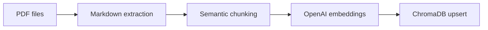
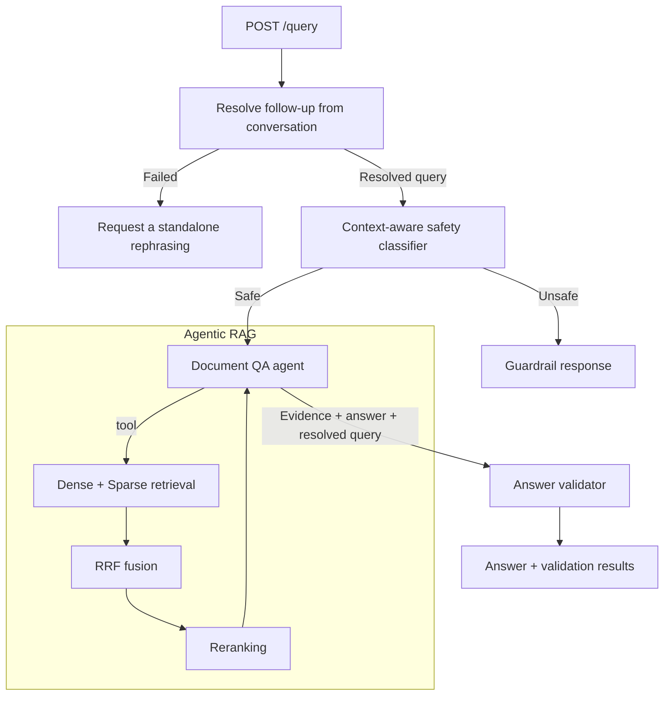

# Document Knowledge Base with Source Grounding

A document question-answering project for indexing local PDFs and answering questions from their contents with page-level source references.

## Features

- Header-aware semantic chunking.
- Hybrid dense and sparse retrieval combined with Reciprocal Rank Fusion (RRF) and Cross-encoder reranking.
- Persistent conversation memory with standalone follow-up resolution.
- Safety classification of the query.
- Retrieval-backed question answering with page-level citations.
- Faithfulness and context-sufficiency evaluation.
- Langfuse observations.
- Served on FastAPI.
- Containerized with Docker.

## How It Works

### Ingestion



### Query serving



The agent may make multiple focused retrieval calls before producing an answer.

## Design

- Ingestion and serving are separate processes because indexing documents and answering questions have different lifecycles.
- ChromaDB provides local persistent vector storage without requiring a separate database service.
- Dense retrieval and BM25 provide complementary semantic and lexical candidates. RRF combines their ranks before a cross-encoder scores relevance to the search query.
- Follow-ups are rewritten once into a standalone query so safety classification, retrieval, answering, and validation share the same interpretation.
- The contextualizer, safety classifier, QA agent, and answer validator have separate responsibilities and model settings.

## Project Structure

```text
src/
  agent/          Pydantic-AI document QA agent and retrieval tool
  config/         Environment-driven application settings
  ingestion/      PDF parsing, chunking, embedding, and ingestion pipeline
  orchestration/  Safety classification, answer validation, and query graph
  retrieval/      ChromaDB, BM25, RRF, and cross-encoder reranking
  utils/          Logging, observability helpers, and shared models
  ingest.py       Ingestion CLI entry point
  serve.py        FastAPI entry point
data/             Input PDFs used by the local and Docker ingestion workflows
pyproject.toml     Direct dependency definitions and uv project metadata
uv.lock            Fully resolved dependency lockfile
Dockerfile         Serving image
Dockerfile.ingest  Ingestion image
docker-compose.yml Ingestion and serving services with persistent volumes
env.example        Environment variable template
```

`pyproject.toml` and `uv.lock` are the dependency sources of truth. The Docker build uses uv in a builder stage and copies only the resulting virtual environment into the Python runtime image.

## Prerequisites

- Python 3.11 or newer.
- [uv](https://docs.astral.sh/uv/) for local dependency management.
- An OpenAI API key.
- Internet access for OpenAI API calls and the initial Hugging Face model download.
- One or more PDFs in `data/`, or another directory selected with `PDF_FOLDER`.
- Docker with Docker Compose for the container workflow.

## Configuration

The application calls `load_dotenv()` and then reads settings from the process environment. Existing runtime environment variables take precedence over values in `.env`; defaults are used for variables that are absent. Set variables before starting the ingestion or serving process.

To use a local dotenv file, copy the template and provide your values:

```powershell
Copy-Item env.example .env
```

`OPENAI_API_KEY` is the only required application setting:

```env
OPENAI_API_KEY=sk-...
```

The configurable defaults are:

| Variable | Default | Used by |
| --- | --- | --- |
| `PDF_FOLDER` | `./data` | Ingestion |
| `EMBED_MODEL` | `text-embedding-3-small` | Both pipelines |
| `EMBED_BATCH_SIZE` | `500` | Both pipelines |
| `CHROMA_COLLECTION` | `knowledge_base` | Both pipelines |
| `CHROMA_PERSIST_DIR` | `./knowledge_base` | Both pipelines |
| `RERANKER_MODEL` | `cross-encoder/mmarco-mMiniLMv2-L12-H384-v1` | Serving |
| `RERANKER_CACHE_DIR` | `./hf_models` | Serving |
| `RERANKER_THRESHOLD` | `0.0` | Serving |
| `CLASSIFIER_MODEL` | `gpt-5.4-nano` | Serving |
| `CONTEXTUALIZER_MODEL` | `gpt-5.4-nano` | Serving |
| `VALIDATOR_MODEL` | `gpt-5.4-nano` | Serving |
| `LLM_MODEL` | `openai:gpt-4o-mini` | Serving |
| `LLM_TEMPERATURE` | `0.0` | Serving |
| `DENSE_TOP_K` | `25` | Serving |
| `BM25_TOP_K` | `25` | Serving |
| `FUSION_TOP_K` | `25` | Serving |
| `FINAL_TOP_K` | `10` | Serving |
| `RRF_K` | `60` | Serving |
| `CONVERSATION_CHECKPOINT_PATH` | `./conversation_checkpoints.sqlite3` | Serving |
| `HISTORY_MAX_TURNS` | `10` | Serving |
| `LANGGRAPH_STRICT_MSGPACK` | `true` | Serving |
| `HOST` | `0.0.0.0` | `src/serve.py` process |
| `PORT` | `8000` | `src/serve.py` process |

All numeric settings must contain values that Python can parse as the corresponding `int` or `float`. ChromaDB uses cosine distance; supported extensions, Markdown header levels, and parallel agent tool calls are fixed in code.

### Optional Langfuse configuration

The application treats tracing as configured when both `LANGFUSE_PUBLIC_KEY` and `LANGFUSE_SECRET_KEY` are present. The example below selects Langfuse Cloud's EU region:

```env
LANGFUSE_PUBLIC_KEY=pk-lf-...
LANGFUSE_SECRET_KEY=sk-lf-...
LANGFUSE_BASE_URL=https://cloud.langfuse.com
LANGFUSE_TRACING_ENABLED=true
LANGFUSE_TRACING_ENVIRONMENT=development
```

The Langfuse SDK also supports `LANGFUSE_TRACING_ENABLED=false` to disable exporting traces. Model and tool instrumentation may include user queries, generated answers, and retrieved text, so enable remote tracing only when that content may leave the deployment environment.

## Observability

When Langfuse credentials are configured, each `/query` request creates a `kb.query` observation containing conversational query contextualization, safety classification, the Pydantic-AI QA agent's model and tool spans, retrieval summaries, answer validation, and the final workflow outcome. Successfully completed validation adds boolean `faithfulness` and `context_sufficiency` trace scores. The response includes `X-Langfuse-Trace-Id` when a trace ID is available.

The ingestion command creates a `kb.ingestion` observation with document, chunk, and failed-file counts. Embedding observations record batch sizes, dimensions, and token usage, but not embedding vectors. Retrieval observations record selected chunk IDs, source pages, and reranker scores rather than copying the selected chunk text into the manual retrieval observation.

Observability initialization, observation creation, trace-ID lookup, flushing, and shutdown are handled defensively so those operations do not intentionally determine the application result. Instrumented model and tool calls are still subject to the behavior of the Langfuse SDK.

## Local Usage

Install the dependencies for both pipelines:

```powershell
uv sync --all-extras
```

Ingest PDFs into the local ChromaDB collection:

```powershell
uv run --extra ingest python src/ingest.py
```

The command exits with an error when the configured folder is missing or contains no matching PDF files. A failure processing an individual PDF is logged and skipped; the remaining files continue, and the command does not fail solely because one or more individual files were skipped.

Start the API:

```powershell
uv run --extra serve python src/serve.py
```

The default address is `http://localhost:8000`. The reranker and tokenizer are loaded during startup, and their first run downloads model files into `RERANKER_CACHE_DIR`.

Send a query:

```powershell
curl.exe -X POST http://localhost:8000/query `
  -H "Content-Type: application/json" `
  -d '{"conversation_id":"14f29586-8309-4e0e-87e3-b53877c935fa","query":"What are the main findings?"}'
```

## API

### `POST /query`

The endpoint accepts a UUID `conversation_id` and one `query` string. Leading and trailing whitespace is removed; the resulting query must contain between 1 and 10,000 characters. Generate a new conversation ID for the first turn and reuse it for every follow-up in that conversation.

```json
{
  "conversation_id": "14f29586-8309-4e0e-87e3-b53877c935fa",
  "query": "What are the main findings?"
}
```

LangGraph checkpoints the conversation state in SQLite. On follow-up turns, a tool-less contextualizer uses recent exchanges to produce one standalone query. Safety classification, retrieval, answer generation, and validation all use that same resolved meaning; only the user's original wording and the final answer are appended to conversation history. Retrieved chunks and tool results remain outside the model-visible history.

Responses produced by the query workflow are `text/plain`. For a completed QA path, the body contains the generated answer followed by a `Validation` block:

```text
<answer with inline source references>

Validation
- Faithful to retrieved documents: true
- Context sufficient to fully answer the query: false
- Context sufficiency reason: <reason from the validator>
```

HTTP 200 means the application completed one of its defined workflow paths; it does not by itself mean the answer passed both validation checks.

| Situation | HTTP status | Response |
| --- | --- | --- |
| Safe query, answer and validation completed | `200` | Answer plus boolean validation results and reasons for failed checks |
| Unsafe query | `200` | Fixed guardrail message; the QA agent is not called |
| Conversational follow-up cannot be resolved | `200` | Fixed rephrasing request; the classifier and QA agent are not called |
| Safety classifier fails or returns no usable assessment | `200` | Fixed classification-failure message; the QA agent is not called |
| Answer validator fails or returns no usable assessment | `200` | Generated answer with both validation fields marked `unavailable` |
| Request body fails FastAPI/Pydantic validation | `422` | FastAPI JSON validation error |
| An unhandled query-processing error reaches the API boundary | `503` | Sanitized plain-text service-unavailable message |

The validator receives the resolved standalone query, completed answer, and deduplicated evidence text and source metadata. Retrieval and reranker scores are excluded. Conversation history helps resolve the query but is not supplied as evidence. The validator checks:

- `faithfulness`: whether each material answer claim is supported by the retrieved chunks or a direct inference from them.
- `context_sufficiency`: whether the retrieved chunks contain enough information to answer every material part of the query.

A failed check does not change the HTTP status. Its boolean value and reason are included in the response body.

## Docker Usage

Build the separate ingestion and serving images:

```powershell
docker compose build ingest serve
```

Run ingestion before starting the API:

```powershell
docker compose run --rm ingest
docker compose up serve
```

The images use uv only in their builder stages. The runtime stages contain Python, the pipeline-specific virtual environment, and the required source files. The serving image installs CPU-only PyTorch.

Docker Compose uses these mounts:

- `./data:/data:ro` exposes the host PDFs read-only to the ingestion container.
- `knowledge_base` persists the ChromaDB collection between ingestion and serving containers.
- `hf_models` caches the Hugging Face reranker and tokenizer files.
- `conversations` persists LangGraph conversation checkpoints across serving-container restarts.

The `serve` service does not depend on or automatically run `ingest`; it expects the shared `knowledge_base` volume to be populated. When PDFs change, rerun ingestion and restart the serving process so its in-memory BM25 index is rebuilt:

```powershell
docker compose run --rm ingest
docker compose restart serve
```

## Source Grounding

The QA agent is instructed to retrieve evidence before answering, use no outside knowledge, and cite factual claims inline as:

```text
[pdf_name, page X]
```

If the indexed documents do not contain enough evidence, the agent is instructed to say so. These grounding and citation requirements are prompt- and model-driven rather than enforced by a deterministic citation parser. The separate validator checks evidence support and context sufficiency, but it does not independently enforce citation syntax.

## Known Limitations

- PyMuPDF4LLM's default automatic OCR decision is available during extraction, but images are not embedded or indexed as image content.
- Chunking splits each page at Markdown `h1`-`h3` headings. There is no secondary chunk-size limit or overlap for long header sections.
- Ingestion uses ChromaDB upserts. Re-indexing changed PDFs does not remove obsolete chunk IDs that are no longer produced.
- The serving process builds its in-memory BM25 index from ChromaDB at startup. It must be restarted after ingestion changes the collection.
- File discovery matches `*.pdf`; uppercase extensions may not match on case-sensitive filesystems.
- Embedding batches for one document are submitted concurrently, so very large documents may encounter provider rate limits.
- Individual PDF failures are skipped and logged without making the overall ingestion command exit non-zero.
- The API has no authentication, rate limiting, or health endpoint.

## License

This project is licensed under the Apache License 2.0. See [LICENSE](LICENSE) for details.
